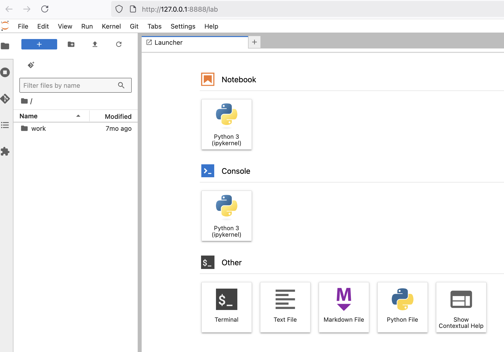

# Tutorial :
## How to install a ready-to-use environment for the DREAM model in a DOCKER container on your local machine


**Purpose:** 
__This tutorial provides  instructions to install a ready-to-use environment to run the DREAM model__. This environment (including fortran compiler, netcdf libraries, python  and all what you need) is provided throught a Docker container that you will run on your own machine. Note that the Docker image is in open acces but  does not contain the model code itself, that we will  download from the DREAM github (_authorized members only_ - if you're not yet part of the group, please contact us). 

This tutorial takes you step-by-step to:

  * Download the Docker Desktop app and install it,
  * Download the Docker image that provides a ready-to-use environment for the DREAM model,
  * Run the Docker container on your laptop,
  * Within the Docker container, download the DREAM model code, tools and notebooks needed for this workshop.


---
# 1. Prerequisites

  * You'll need  to be a member of the dream-gcm GitHub organization to download the DREAM model code (**if not a member aleady, send us your github login** so that we can  add you in the group. If you don't have a GitHub login yet, it is not too late, some help [here](https://docs.github.com/en/get-started/start-your-journey/creating-an-account-on-github).
  * You'll need to know your github identifiers (and to have a personal token at hand to be able to clone the private repository of the DREAM code. If you don't know if you have a personal token yet, here is a [cheat sheet to generate one](https://chatgpt.com/share/6870d610-49cc-800c-b047-1f5099b1b3b0)). Don't worry, we will try to help those of you who are beginners with GitHub if you need.
  * You'll need to be ROOT on your computer to be able to install the Docker Desktop app (instructions below), OR ELSE you'll need to already have Docker installed on your machine before coming to the workshop.


---
# 2 Install the Docker Desktop app 
_[This step have to be done just once for all.]_

* Go to the website: [https://www.docker.com/products/docker-desktop/](https://www.docker.com/products/docker-desktop) and click on the blue button `DOWNLOAD the DOCKER APP`.

There is a version for Mac OS, Linux and Windows plateforms (however we won't be able to provide full support for Windows users - you'll be on your own). 

---
# 3 Load the DREAM Docker image 
_[These steps have to be done just once for all.]_

* a. Launch the Docker Desktop app (double-click on the icon). It opens a window that you can then close but Docker will now be running in the background and the Docker commands are now available in your terminal.
* b. In a terminal on your laptop, run the docker command below to download the DREAM Docker image on your local machine. It might take a while to download depending on your internet connexion (several minutes in any case).

  ```
  docker pull  ghcr.io/dream-gcm/dreamgcm-env:latest
  ```
The long downloading  has to be done only once for all. Then it  will be kept  on your local machine and you can re-activate it anytime by running the Docker app and the Docker command in the terminal as explained just below.


---
# 4. Run the DREAM Docker container
_[These steps have to be done each time you want to use the DREAM model.]_

* a. On your local machine, open the Docker Desktop app if not already open.
* b. Then in a terminal on your local machine, create a directory where you will work for the workshop:
    ```
      cd your-local-path
      mkdir MY-DREAM-WORKSHOP
    ```
* c. in the terminal, run the docker command below, after editing  the path `your-local-path-to-MY-DREAM-WORKSHOP/` to your own workshop directory that you have just created:

  ```
  docker run -it --rm -p 8888:8888 -v your-local-path-to-MY-DREAM-WORKSHOP/:/home/jovyan/work ghcr.io/dream-gcm/dreamgcm-env:latest jupyter lab --ip=0.0.0.0 --no-browser --allow-root
  ```
You should now have some text printed in the terminal saying that a server is running. 

But first, here are some  explanations on what the above command does:

> In this command, we tell Docker to run the Docker image “dreamgcm-env” from the GitHub website `ghcr.io/dream-gcm/dreamgcm-env` and inside the Docker,  run the JupyterLab  and   link port 8888 to the port inside the image to display the Jupyterlab. **Importantly** we also link  your local workshop directory on your machine (`your-local-path-to-MY-DREAM-WORKSHOP/`) to the virtual directory `/home/jovyan/work/` in the Docker image. Once in the Docker, you will work in `/home/jovyan/work/` but your actions will happen and remain in `your-local-path-to-MY-DREAM-WORKSHOP/` even after you close the Docker session.

*  c. Copy the link displayed in the terminal that starts with  http://127.0.0.1:8888/lab?token=…….  (copy the entire token with all the numbers)
*  d. Paste this link in your favourite browser. It should open a JupyterLab window like this:
  


*  e. Click on the “Terminal” icon to open a terminal in your Docker/JupyterLab session.
  
---
# 5. Download the DREAM code, tools and notebooks for the workshop
* In the terminal you have just open in your Docker/JupyterLab session in the browser, do:

```
cd work

# clone DREAM model code
git clone https://github.com/dream-gcm/DREAM.git

# clone tools and notebooks prepared for the workshop
git clone https://github.com/dream-gcm/workshop-notebooks-2025.git
  
# In the code directory, switch to the branch `dev-in-Docker` developped specifically for the workshop.
cd DREAM
git checkout dev-in-Docker
```


**--> Congratulations! You're now ready to play with the DREAM model!.**

---
# 6 Close Docker 
* (Only) when you are done with your DREAM model session, you can close the Docker app and the terminal from which you had run the Docker command.
* Next time you want to use the model, start the instructions at section 4 above.
